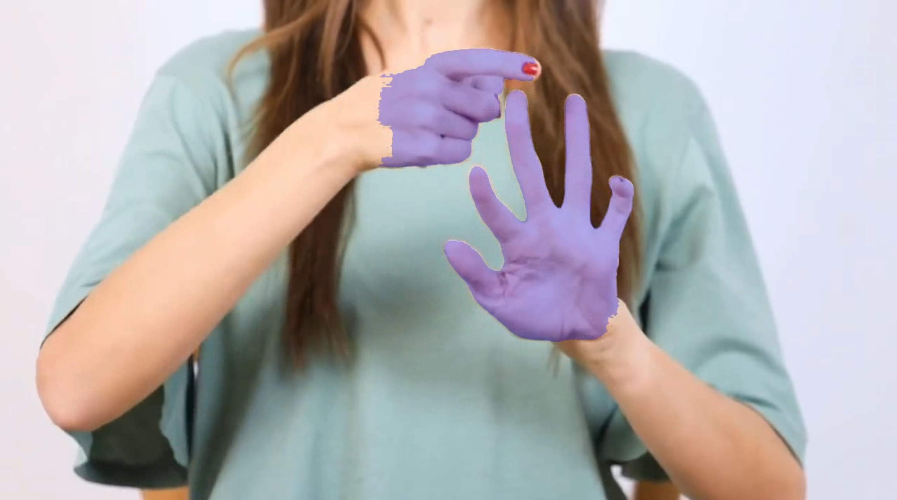

# Hand Tracking System using MediaPipe and SAM 2.1

A hand tracking system that combines MediaPipe's hand detection with SAM 2.1's tracking models. The system first detects hands in the initial frame using MediaPipe, then tracks them through the video using SAM 2.1's advanced segmentation model.

## Sample Output


*Sample frame showing hand tracking with blue overlay*

A complete output video demonstration can be found in the `code/output` directory:
- `code/output/output_demo.mp4`: Full video showing hand tracking results

## Features

- Initial hand detection using MediaPipe
- Advanced tracking using SAM 2.1
- Support for multiple hands
- Output video with semi-transparent overlays
- Handles video files in common formats

## Prerequisites

```bash
conda create -n sam2 python=3.12
conda activate sam2
pip install torch torchvision torchaudio --index-url https://download.pytorch.org/whl/cu118
pip install mediapipe opencv-python
```

Additionally, you'll need to:
1. Install SAM 2.1 following the instructions from the official repository
2. Download the pretrained SAM 2.1 model weights
3. Copy the configuration files to your project directory

### Installing Dependencies

You can install the required packages using the provided `requirements.txt`:

```bash
pip install -r requirements.txt
```

## Project Structure

```
hand-tracking/
├── configs/
│   └── sam2.1/
│       └── sam2.1_hiera_t.yaml
├── checkpoints/
│   └── sam2.1_hiera_tiny.pt
├── hand_detector.py
├── sam_tracker.py
├── main.py
└── README.md
```

## Usage

The system can be run from the command line with the following arguments:

```bash
python main.py <input_video> <output_video> <sam_checkpoint> <model_config>
```

Where:
- `<input_video>`: Path to the input video file
- `<output_video>`: Path where the processed video will be saved
- `<sam_checkpoint>`: Path to the pretrained SAM 2.1 model weights
- `<model_config>`: Path to the SAM 2.1 model configuration file

### Example

```bash
python main.py input/test.mp4 output/output.mp4 checkpoints/sam2.1_hiera_tiny.pt configs/sam2.1/sam2.1_hiera_t.yaml
```

## Configuration Files

For convenience, the necessary configuration files have been copied to the project's main directory:

- `configs/sam2.1/sam2.1_hiera_t.yaml`: Configuration for the SAM 2.1 model
- `checkpoints/sam2.1_hiera_tiny.pt`: Pretrained model weights

## Components

### 1. Hand Detector (`hand_detector.py`)
- Uses MediaPipe for initial hand detection
- Provides bounding box coordinates for detected hands
- Configurable confidence thresholds for detection and tracking

### 2. SAM Tracker (`sam_tracker.py`)
- Implements SAM 2.1 tracking functionality
- Handles video frame extraction and processing
- Manages tracking state and mask propagation
- Creates visualization with overlays

### 3. Main Script (`main.py`)
- Coordinates the detection and tracking pipeline
- Handles command-line arguments
- Manages video I/O operations

## Output

The system generates a processed video where tracked hands are highlighted with a semi-transparent blue overlay (30% opacity). The tracking is continuous throughout the video, maintaining consistent hand identification across frames.

## Technical Details

### Hand Detection
- Uses MediaPipe's hand detection model
- Supports detection of multiple hands
- Returns bounding boxes in format: [x1, y1, x2, y2]
- Includes padding for better tracking initialization

### Tracking
- Initializes tracking from first-frame detections
- Propagates masks through subsequent frames
- Maintains consistent hand identification
- Handles occlusions and complex movements

## Performance Considerations

- GPU acceleration is automatically used when available
- Temporary frames are saved to disk for reliable processing
- Efficient memory management through resource cleanup

## Limitations

- Requires clear initial hand detection for tracking
- Performance depends on video resolution and hardware
- Temporary storage requirements for frame extraction
